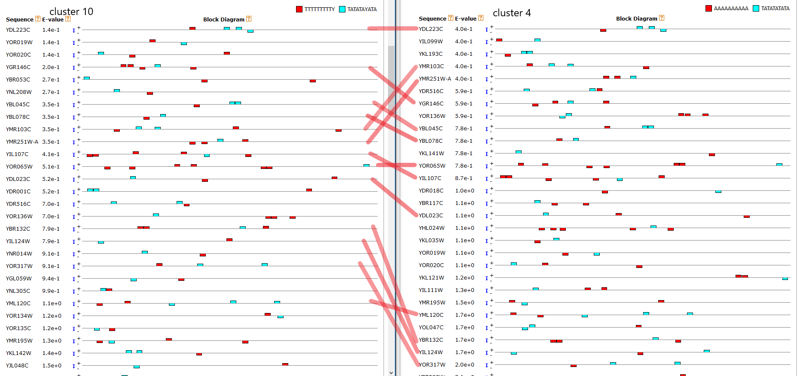

---
title: "Motif Operations"
output:
  html_notebook:
    error: no
    message: no
    toc: yes
    toc_depth: 4
    toc_float: yes
    warning: no
  pdf_document:
    toc: yes
    toc_depth: '4'
---
```{r setup, include=FALSE}
knitr::opts_chunk$set(cache=TRUE)
```

#Intro

This Rnotebooks cover the later part of 3' motif finding project, it contains description about:

* **motif search** by MEME 

* **motif occurence observation** by MAST

* **motif comparisons** by TOMTOM

Three steps above use tools from MEME-suite, which is a basic and commonly used toolset for motif discovery operation. Shell scripts for running those tools will be described here, but they can't run properly in Rstudio. The user has to run the scripts in linux-shell.

**main reasons why this toolset was chosen** 

* user-friendly

* simple commands, 

* detailed description and example 

* all-in-one toolset

* was used by the original paper

**Note:** Alternative motif operation tools other than MEME-suite has not been tested yet.

The later part of this notebook describes post-processing pipeline which will 

* **gather and rearrange MEME results** into simplified and tidy tables. 

#Motif discovery

After we separate 500bp upstream and downstream sequences into clusterห, we then search for the motif sequences in each cluster. MEME will look for the short sequences which appear in every sequence in the cluster aka motif and report them into MEME-html/xml/txt formats. These files will be used as inputs for downstream process such as counting motif occurence in region other than the discovery cluster or comparing motif to database. 

First, we will start with building background base frequency from whole genome sequences of 500bp upstream and downstream. Then feed the clustered sequence files to MEME to find the motifs.

**Starting File**

* background file: background_down.fasta/background_up.fasta 

* clustered sequence cluster: cluster_1025_Ward (extract to the home directory)

##Build the background markov model

This function will convert 500bp sequence set downloaded from ensmbl database to FASTA file for background frequncy calculation. (Actually it can also be used to convert any gene-sequence fetched from ensmbl to fasta)

```{r}
library(tidyverse)
library(magrittr)
library(Biostrings)
```


define function
```{r}
create_background_from_sequence_table<-function(sequence_file){
  #print out FASTA file      
      output_tab<-sequence_file%>%pull(coding_gene_flank)%>%DNAStringSet()
      names(output_tab)<-sequence_file$ensembl_gene_id
      region_vector<-unlist(strsplit(deparse(substitute(sequence_file)),"_"))[1]
      tab_name<-paste0("background_",region_vector,".fasta")
      writeXStringSet(output_tab, tab_name, format="fasta")
      
}
```

```{r}
create_background_from_sequence_table(down_500)
create_background_from_sequence_table(up_500)
```

###background model calculation

This step was done by using MEME suite command fasta-get-markov to create background model. -m argument control markov model order. These are shell command so they need to be typed outside Rstudio. 
```{bash eval=FALSE}
fasta-get-markov -m 1 < background_down.fasta > bg_down-model-1
fasta-get-markov -m 1 < background_up.fasta > bg_up-model-1

```

##Background_motif script

This is the script for motif discovery for background file. The resuts are used to compare the effect of inputs (whole genome [background] vs clusters). The speculation is that very common motifs could be found from the whole genome set, any noise should have no effect to them. Motif width was set to 10bp maximum by the common binding site size of regulatory motifs.

**background_meme.sh**

to run: bash background_meme.sh & or nohangup: nohup sh background_meme.sh &
```{bash eval=FALSE}
#!/bin/sh
home_dir=$(pwd)
echo begin_down
date
mkdir background_down
#-dna: specify data in fasta file
#-revcomp: consider reverse complement
#-mod anr: Any Number of Repetitions (a motif might repeats multiple times in one sequence)
#-evt: e-value treashold
#-p 20: paralellise the task to speed things up
#bfile:  background file
#maxw, minw: maximum and minimum width
/usr/local/meme5/bin/meme ./background_down.fasta -dna -revcomp -mod anr -oc $home_dir/background_down -nmotifs 50 -evt 0.005 -brief 1000000 -p 20 -bfile $home_dir/bg_down-model-1 -maxw 10 -minw 6
echo begin_up
date
mkdir background_up
/usr/local/meme5/bin/meme ./background_up.fasta -dna -revcomp -mod anr -oc $home_dir/background_up -nmotifs 50 -evt 0.005 -brief 1000000 -p 20 -bfile $home_dir/bg_down-model-1 -maxw 10 -minw 6
echo finish at:
date
```


##Motif discovery script

This script will read clustered sequence fasta files and extract motif from each cluster. The assumption is that genes in the same cluster, which are grouped together by expression pattern, would be likely to have the same set of regulators. And the regulatory element found in this step might be linked to environmental stress response since the expression patterns from the original dataset were the outcome of enviromental treatment to yeast. 

The very simplified diagram could be like this:

gene expression patterns<-regulatory elements<-environmental stresses

What were observed in the original dataset:

gene expression patterns<-environmental stresses

What we tried to dig out from the dataset are [regulatory elements] or motifs.

Motif width was set to 10bp maximum by the common binding site size of regulatory motifs.

**meme.sh**
to run: bash meme.sh & or nohangup: nohup sh meme.sh &

edit: vi meme.sh 

add permission to user: chmod +x meme.sh

```{bash,eval=FALSE}
#!/bin/sh
echo begin_down
echo check dir 
pwd
date
#choose directory
#set a mainfolder (the folder which contains folder of clustered sequence files; the results from previous step)
folder_of_interest="cluster_1025_Ward"
dir_list=$(ls -d ./$folder_of_interest/*)
echo $dir_list
#loop for a folder of each clustering (in case there are more than one cluster number used)
for dir in $dir_list
do 
home_dir=$(pwd)
cd "$home_dir/$dir"
echo current directory:
pwd
#loop for each clustered sequence grou resulted from clustering
for file in $home_dir/$dir/*down.fasta; 
do 
echo ${file}
echo start processing $(basename "$file") at:
date
#-dna: specify data in fasta file
#-revcomp: consider reverse complement
#-mod anr: Any Number of Repetitions (a motif might repeats multiple times in one sequence)
#-evt: e-value treashold
#-p 20: paralellise the task to speed things up
#bfile:  background file
#maxw, minw: maximum and minimum width
/usr/local/meme5/bin/meme ${file} -dna -revcomp -mod anr -oc $(basename "$file" .fasta) -nmotifs 30 -evt 0.005 -brief 1000000 -p 20 -bfile $home_dir/bg_down-model-1 -maxw 10 -minw 6
echo finish at:
date
done 
#back to working directory
cd "$home_dir"
echo back to working directory
pwd
done

echo down_meme finished at:
date

echo check dir
pwd
#repeat above loop to upstream sequences
echo begin_up
folder_of_interest="cluster_1025_Ward"
dir_list=$(ls -d ./$folder_of_interest/*)
echo $dir_list
for dir in $dir_list
do
home_dir=$(pwd)
cd "$home_dir/$dir"
echo current directory:
pwd
for file in $home_dir/$dir/*up.fasta;
do
echo ${file}
echo start processing $(basename "$file") at:
date
/usr/local/meme5/bin/meme ${file} -dna -revcomp -mod anr -oc $(basename "$file" .fasta) -nmotifs 30 -evt 0.005 -brief 1000000 -p 20 -bfile $home_dir/bg_up-model-1 -maxw 10 -minw 6
echo finish at:
date
done
cd "$home_dir"
echo back to working directory
done
echo up_meme finished at:
pwd

```

#Motif Search

As mentioned earlier, MEME will extract motifs from each cluster and store them in seperatly created subfolder. Next we will count an occurence of every motif in every cluster using MAST tool. As a part of MEME-suite, MAST accepts every types of MEME result files (.html, .xml, or even .txt). Therefore, we can feed the files created in the previous step into this tool directly without any conversion requirement.   

Motif search script
```{bash,eval=FALSE}
#!/bin/sh
echo begin
date
#choose directory
folder_of_interest="cluster_1025_Ward"
echo check working dir:
dir_list=$(ls -d ./$folder_of_interest/*)
echo $dir_list
#loop for a folder of each clustering
for dir in $dir_list
do
home_dir=$(pwd)
cd "$home_dir/$dir"
echo current directory:
pwd

#loop for each cluster resulted from clustering
for query in $(find $home_dir/$dir -name '*meme.html' |sort);
do
echo $query
target01=$(find $home_dir/$dir -name '*up.fasta'| sort)
for target in $target01
do
echo target file $target
#mast_out is created to store each mast result for each cluster in their respective subfolder.
#because there is no control over output filename (it always uses mast.html/.xml/.txt), we have to create subfolder system for mast loop in order to protect the result files from getting overwritten.
#rm -r $(dirname $query)/mast_out/
mkdir $(dirname $query)/mast_out/
/usr/local/meme5/bin/mast ${query} ${target} -oc $(dirname $query)/mast_out/$(basename $target .fasta) -bfile $home_dir/bg_up-model-1
done
target02=$(find $home_dir/$dir -name '*down.fasta'| sort)
for target in $target02
do
echo target file $target
#rm -r $(dirname $query)/mast_out/
mkdir $(dirname $query)/mast_out/
/usr/local/meme5/bin/mast ${query} ${target} -oc $(dirname $query)/mast_out/$(basename $target .fasta) -bfile $home_dir/bg_down-model-1
done
done
cd "$home_dir"
done

```

#Motif comparison

There might be a chance that some of the extracted motifs are similar. To reduce possible redundancy, highly similar motifs will be grouped using TOMTOM, which is motif comparison tool in MEME-suite. This tool will compare the input motifs to database and calculate similarity for each pair. To simplify the process, motifs will be gathered in one file (meme_up and meme_down) according to the their location (upstream or downstream) because we want to compare the different between those two. 

To sum up, this step has four comparisons;
Self-comparisons: upstream-upstream/downstream-downstream
comparisons between region: upstream-downstream/upstream-downstream

Additionally, we will also compare our motifs with other database such as:
JASPAR: transcription factor binding site
stability motifs
original paper motifs
sublocalization motifs
So, the code of that part is included here.

meme2meme
```{bash,eval=FALSE}
#!/bin/sh
echo begin
date
#choose directory
folder_of_interest="cluster_1025_Ward"
echo check working dir:
dir_list=$(ls -d ./$folder_of_interest/*)
echo $dir_list
#loop for a folder of each clustering
for dir in $dir_list
do
home_dir=$(pwd)
cd "$home_dir/$dir"
echo current directory:
pwd
echo merge upstream_motifs
meme_up=$(find $home_dir/$dir -path '*up/meme.html'| sort)
echo $meme_list
/usr/local/meme5/libexec/meme-5.0.0//meme2meme $meme_up -numbers -bg $home_dir/bg_up-model-1 > meme_up.txt
echo merge downstream_motifs
meme_down=$(find $home_dir/$dir -path '*down/meme.html'| sort)
echo $meme_list
/usr/local/meme5/libexec/meme-5.0.0//meme2meme $meme_down -numbers -bg $home_dir/bg_down-model-1 > meme_down.txt
done

```

tomtom
```{bash,eval=FALSE}
#!/bin/sh
echo begin
date
#choose directoy
folder_of_interest="cluster_1025_Ward"
echo check working dir:
dir_list=$(ls -d ./$folder_of_interest/*)
echo $dir_list
#loop for a folder of each clustering
for dir in $dir_list
do
home_dir=$(pwd)
cd "$home_dir/$dir"
echo current directory:
pwd
mkdir $home_dir/$dir/tomtom_out
echo self_comparison


/usr/local/meme5/bin/tomtom meme_down.txt meme_down.txt -oc $home_dir/$dir/tomtom_out/down_down/  -thresh 0.05 #-evalue  # -bfile $home_dir/bg_down-model-1
/usr/local/meme5/bin/tomtom meme_up.txt meme_up.txt -oc $home_dir/$dir/tomtom_out/up_up/  -thresh 0.05 #-evalue # -bfile $home_dir/bg_up-model-1
echo pair_comprison
/usr/local/meme5/bin/tomtom meme_up.txt meme_down.txt -oc $home_dir/$dir/tomtom_out/up_down/  -thresh 0.05 #-evalue # -bfile $home_dir/bg_up-model-1
/usr/local/meme5/bin/tomtom meme_down.txt meme_up.txt -oc $home_dir/$dir/tomtom_out/down_up/ -thresh 0.05 #-evalue # -bfile $home_dir/bg_down-model-1 

echo jaspar-search
/usr/local/meme5/bin/tomtom meme_down.txt $home_dir/JASPAR2018_CORE_fungi_non-redundant_pfms_meme.txt -oc $home_dir/$dir/tomtom_out/down_JASPAR/ -thresh 0.05 #-evalue #-bfile $home_dir/bg_down-model-1
/usr/local/meme5/bin/tomtom meme_up.txt $home_dir/JASPAR2018_CORE_fungi_non-redundant_pfms_meme.txt -oc $home_dir/$dir/tomtom_out/up_JASPAR/ -thresh 0.05 #-evalue #-bfile $home_dir/bg_up-model-1
echo Stability-search
/usr/local/meme5/bin/tomtom meme_down.txt $home_dir/stab_motif -oc $home_dir/$dir/tomtom_out/down_stability -thresh 0.05 #-evalue #-bfile $home_dir/bg_down-model-1
/usr/local/meme5/bin/tomtom meme_up.txt $home_dir/stab_motif -oc $home_dir/$dir/tomtom_out/up_stability/ -thresh 0.05 #-evalue #-bfile $home_dir/bg_up-model-1
echo Gasch-search
/usr/local/meme5/bin/tomtom meme_down.txt $home_dir/GASCH_motif -oc $home_dir/$dir/tomtom_out/down_Gasch/ -thresh 0.05 #-evalue #-bfile $home_dir/bg_down-model-1
/usr/local/meme5/bin/tomtom meme_up.txt $home_dir/GASCH_motif -oc $home_dir/$dir/tomtom_out/up_Gasch/ -thresh 0.05 #-evalue #-bfile $home_dir/bg_up-model-1
echo sublocalize-search
/usr/local/meme5/bin/tomtom meme_down.txt $home_dir/subloc_motif -oc $home_dir/$dir/tomtom_out/down_sublocalization/ -thresh 0.05 #-evalue #-bfile $home_dir/bg_down-model-1
/usr/local/meme5/bin/tomtom meme_up.txt $home_dir/subloc_motif -oc $home_dir/$dir/tomtom_out/up_sublocalization/ -thresh 0.05 #-evalue #-bfile $home_dir/bg_up-model-1
echo finished at:
date

done

```

#Gather results into motif and gene exprssion table

After we finished with MEME-suite, the next step is to gather results and summarize them into one place. In this final step, we try to follow the tidy layout as described in http://garrettgman.github.io/tidying/ to make the data easier to work with in the downstream analyses.  
There are three rules to follow:

* Each variable in the data set is placed in its own column
* Each observation is placed in its own row
* Each value is placed in its own cell*


Recap.

Our hypothesis is:
gene expression patterns<-regulatory elements<-environmental stresses

What were observed in the original dataset:

gene expression patterns<-environmental stresses

now we have motifs, motif occurence, which are regulartory element:

gene expression patterns<-[motifs & motif occurence]<-environmental stresses

Next, we want to establish the link between motifs & motif occurence and gene expression patterns. This can be done in several scale such as cluster level and individual genes level. So, we will prepare materials first, starting with expression table.

requirement: tidyverse

##Generate expression table

cluster table
```{r}
head(WardD2.cluster_table)
```
generate new table with gene name with cluster number used
```{r}
cluster_number<-as.tibble(WardD2.cluster_table[,"cluster_19"])
cluster_number$rowname<-rownames(WardD2.cluster_table)
```
```{r}
cluster_number
```

generate exression table
```{r}
expression_table<-as.tibble(rownames_to_column(as.data.frame(init_table_142.mat)))
```
```{r}
expression_table
```

merge exprssion table with cluster number table
```{r}
expression_table_with_cluster_number<-left_join(cluster_number,expression_table, by="rowname")
```
```{r}
expression_table_with_cluster_number
```

export table
```{r}
write.table(expression_table_with_cluster_number, file=paste0("./expression_table_with_cluster_number_",unlist(str_split(getwd(),pattern="/"))[4],".txt"), sep="\t")
```

##summarise expression table by cluster

```{r}
summarized_expression_table<-expression_table_with_cluster_number%>%dplyr::select(-rowname) %>% group_by(value) %>% summarise_all(funs(mean(., na.rm = TRUE)))%>%dplyr::rename(cluster = value) 
```
```{r}
summarized_expression_table
```

export summarised table
```{r}
write.table(summarized_expression_table, file=paste0("./summarized_expression_table_",unlist(str_split(getwd(),pattern="/"))[4],".txt"), sep="\t")
```

##Create motifs table

Then, we will generate a motif table. There are several way to generate motif table as there are different type of meme results files such as .html, .xml, and .txt. Here, we will use xml files as their format easier for machine to access. It might be a little bit complicated but very suitable for automated process.

read XML results files and extract their information into small tables, then join the tables into one big table.

**xml2** can read xml files and extracts the content inside. Iterative operation (apply-functions or purrr series) are applicable.

```{r message=FALSE, warning=FALSE, paged.print=FALSE}
library(xml2)
```

###prepare iteration

```{r}
#set operational folder
folder_of_interest<-"cluster_1025_Ward"
#fetch .xml list
#get cluster number list
clust_max_list<-list.dirs(path = paste0("./",folder_of_interest), full.names = FALSE, recursive = FALSE)
```
```{r}
clust_max_list
```
```{r}
#get subfolder list
clust_all_subfolder_list<-list.dirs(path = paste0("./",folder_of_interest), full.names = FALSE, recursive = TRUE)
#filter out "mast"
clust_all_subfolder_list<-grep("in",clust_all_subfolder_list,value = TRUE)
clust_all_subfolder_list<-grep("mast",clust_all_subfolder_list,value = TRUE,invert = TRUE)
#if there is more than one cluster number, one more filter might be needed
#clust_all_subfolder_list<-grep("cluster_19_005",clust_all_subfolder_list,value = TRUE)
```

```{r}
clust_all_subfolder_list
```

```{r}
#get .xml list
all_xml_list<-list.files(path =  paste0("./",folder_of_interest), pattern = "meme.xml", all.files = TRUE, full.names = TRUE, recursive = TRUE, include.dirs = FALSE, no.. = TRUE)
#if there is more than one cluster number, one more filter might be needed
#all_xml_list<-grep("cluster_19_005",all_xml_list,value = TRUE)
```
```{r}
all_xml_list
```

###extraction operation
```{r}
#from all_xml_list, pick up one file
#pickup one cluster number
i<-clust_max_list[1]
folder_name<-i
#create for subfolder list
subfolder_name<-grep(paste0("^",i), clust_all_subfolder_list,value=TRUE)
```
```{r}
subfolder_name
```
```{r}
#pickup one subfolder
j<-subfolder_name[1]
```
```{r}
#prepare source object
cluster_name.temp<-gsub(j,pattern = "cluster_[0-9]/",replacement = "")
#source of motifs
motif_source=unlist(strsplit(cluster_name.temp,"/"))[1]
#target of motif occurence query
target_cluster<-unlist(strsplit(cluster_name.temp,"/"))[2]
#split target of motif occurence query into cluster and region
target_cluster_folder<-paste(unlist(strsplit(target_cluster,"_"))[1:4],collapse = "_")
region<-paste(unlist(strsplit(cluster.sub,"_"))[5])
```
```{r}
cluster_name.temp
motif_source
target_cluster
target_cluster_folder
region
```
call library
```{r}
library(xml2)
```

```{r}
#read .xml files, there are 4 nodes
read_xml(xml_file)
```

###extract motifs details from .xml
```{r}
#extract xml childnode
read_xml(xml_file)%>% xml_child(search="motifs")
```
```{r}
#extract attributes from nodes
read_xml(xml_file)%>% xml_child(search="motifs")%>%xml_children()%>%map(xml_attrs)
```
```{r}
#group each attributes together by transpose()
read_xml(xml_file)%>% xml_child(search="motifs")%>%xml_children()%>%map(xml_attrs)%>%transpose()
```
```{r}
#convert transposed attributes to tibble
read_xml(xml_file)%>% xml_child(search="motifs")%>%xml_children()%>%map(xml_attrs)%>%transpose()%>%as_tibble
```
```{r}
#unnest the table
read_xml(xml_file)%>% xml_child(search="motifs")%>%xml_children()%>%map(xml_attrs)%>%transpose()%>%as_tibble%>%unnest()
```
```{r}
#select only used attributes
read_xml(xml_file)%>% xml_child(search="motifs")%>%xml_children()%>%map(xml_attrs)%>%transpose()%>%as_tibble%>%unnest()%>%dplyr::select(c(name,width,sites,e_value))
```
extract regular expression
```{r}
#regular expression is a child node of motifs so we have to dig deeper than motif details
read_xml(xml_file)%>%xml_child(search="motifs")%>%xml_children()%>%xml_child(search="regular_expression")
```
```{r}
#extract the elements and trim out "\n"
read_xml(xml_file)%>%xml_child(search="motifs")%>%xml_children()%>%xml_child(search="regular_expression")%>%xml_text(trim=TRUE)
```
extract source directory from training_set node

```{r}
#magrittr package has extract2(), which allow the users to specify element they want to extract. Has same function as object[element], but work with onelining
library(magrittr)

```


```{r}
read_xml(xml_file)%>%xml_child(search="training_set")%>%xml_attrs()%>%extract2(1)
```
put them into object
```{r}
source_filename<-read_xml(xml_file)%>%xml_child(search="training_set")%>%xml_attrs()%>%extract2(1)

regular_expression<-read_xml(xml_file)%>%xml_child(search="motifs")%>%xml_children()%>%xml_child(search="regular_expression")%>%xml_text(trim=TRUE)

motif_profile<-read_xml(xml_file)%>%xml_child(search="motifs")%>%xml_children()%>%map(xml_attrs)%>%transpose()%>%as_tibble%>%unnest()%>%dplyr::select(c(name,width,sites,e_value))
```

put everything into a table
```{r}
cbind.data.frame(source_directory=paste0("./",folder_of_interest), cluster=cluster.main,cluster=cluster.sub,region=region,target_file=source_filename,motif_profile,regular_expression)
```

Then, we will make a loop to automate this process.

###Define functions
```{r}
#define functions to reduce loop complexity
setup_iteration<-function(folder_of_interest, cluster_of_interest){
  #folder_of_interest: string vector of target folder
  #cluster_of_interest: a name of subfolder of target max_cluster
  
  
  ################cluster number list section####################
  #get cluster number list
  clust_max_list<-list.dirs(path = paste0("./",folder_of_interest), full.names = FALSE, recursive = FALSE)
  
  
  ################subfolder list section####################
  #get subfolder list
  clust_all_subfolder_list<-list.dirs(path = paste0("./",folder_of_interest), full.names = FALSE, recursive = TRUE)
  #filter out "mast"
  clust_all_subfolder_list<-grep("in",clust_all_subfolder_list,value = TRUE)
  clust_all_subfolder_list<-grep("mast",clust_all_subfolder_list,value = TRUE,invert = TRUE)
  #if there is more than one cluster results, one more filter might be needed
  clust_all_subfolder_list<-grep(cluster_of_interest,clust_all_subfolder_list,value = TRUE)
  
  
  ################.xml list section####################
  #get .xml list
all_xml_list<-list.files(path =  paste0("./",folder_of_interest), pattern = "meme.xml", all.files = TRUE, full.names = TRUE, recursive = TRUE, include.dirs = FALSE, no.. = TRUE)
  #if there is more than one cluster number, one more filter might be needed
  all_xml_list<-grep(cluster_of_interest,all_xml_list,value = TRUE)
  return(list(clust_max_list,clust_all_subfolder_list,all_xml_list))
}

extract_cluster_profile<-function(j){
  #prepare source object
  source_folder<-gsub(j,pattern = "cluster_[0-9]/",replacement = "")
  #source of motifs
  motif_source=unlist(strsplit(source_folder,"/"))[1]
  #target of motif occurence query
  target_cluster_and_region<-unlist(strsplit(source_folder,"/"))[2]
  #split target of motif occurence query into cluster and region
  target_cluster<-paste(unlist(strsplit(target_cluster_and_region,"_"))[1:4],collapse = "_")
  region<-paste(unlist(strsplit(target_cluster_and_region,"_"))[5])
  return(list(source_folder,motif_source, target_cluster, region))
}


extract_sourcefilename<-function(xml_file){
  read_xml(xml_file)%>%xml_child(search="training_set")%>%xml_attrs()%>%extract2(1)
}

#check motif existence. If there is no motif found from the cluster, return NA
data_length_check<-function(xml_file){
  data_length<-read_xml(xml_file)%>%xml_child(search="motifs")%>%xml_children()%>%length()
  if(data_length==0){
    return(NA)
    next
  }
  
}

extract_motif_profile<-function(xml_file){
  read_xml(xml_file)%>% xml_child(search="motifs")%>%xml_children()%>%map(xml_attrs)%>%transpose()%>%as_tibble%>%unnest()%>%dplyr::select(c(name,width,sites,e_value))
}


extract_regular_expression<-function(xml_file){
  read_xml(xml_file)%>%xml_child(search="motifs")%>%xml_children()%>%xml_child(search="regular_expression")%>%xml_text(trim=TRUE)
}

combine_table<-function(motif_source,target_cluster,region,source_filename,motif_profile,regular_expression){
  cbind.data.frame(source_directory=paste0("./",folder_of_interest), cluster_number=motif_source,cluster=target_cluster,region=region,target_file=source_filename,motif_profile,regular_expression)%>%as_tibble()%>%mutate_if(is.factor, as.character)
}

#define operating function
get_motif_table<-function(j){
  #wrap all function above
  
  cluster_proile_list<-extract_cluster_profile(j)
  source_folder<-cluster_proile_list[[1]]
  motif_source<-cluster_proile_list[[2]]
  target_cluster<-cluster_proile_list[[3]]
  region<-cluster_proile_list[[4]]
  
  #select xml file
  xml_file<-grep(source_folder, all_xml_list,value=TRUE)  
  
  source_filename<-extract_sourcefilename(xml_file)
  
  motif_profile<-extract_motif_profile(xml_file)
    
  regular_expression<-extract_regular_expression(xml_file)
  #the function output  
  table_part.tmp<-combine_table(motif_source,target_cluster,region,source_filename,motif_profile,regular_expression)
}

#set failsafe, continue working with even with error, return NA in case of error
get_motif_table_failsafe<-possibly(get_motif_table,NA_real_)
```

loop setup
```{r}
folder_of_interest<-"cluster_1025_Ward/"
cluster_of_interest<-"cluster_19"

iterate_setting_list<-setup_iteration(folder_of_interest = folder_of_interest, cluster_of_interest = cluster_of_interest)

clust_max_list<-iterate_setting_list[[1]]
clust_all_subfolder_list<-iterate_setting_list[[2]]
all_xml_list<-iterate_setting_list[[3]]

#generate a blank table
motif_table<-NA

#data gethering loop
#loop for each max cluster number
for(i in clust_max_list){
  folder_name<-i
  #filter subfolder name by  max cluster number
  subfolder_name<-grep(paste0("^",i), clust_all_subfolder_list,value=TRUE)
  #get table
  motif_table<-map(subfolder_name,get_motif_table_failsafe)%>%discard(is.na(.))%>%purrr::reduce(bind_rows)
  #write dirty (raw, uncleaned) table
  write.table(motif_table, file="./motif_table_dirty.txt", sep="\t", row.names = FALSE, quote=F)
}

```

###Results
```{r}
motif_table
```

#Starting point of data analysis

Here, the preliminary motif discovery is completed. Next we will expand the motif table by combining motif data with expression table (142 conditions or 160 conditions up to the user) and motif occurences. And the final table will become the input for further analyses and modeling. 

The main reason behind table expansion is that, the prediction model (SITAR, if it will still be used) assumes regulator activities from the number of their binding sites near each genes. So, we need to put each motif occurrence in the expression table. The ideal table would be like this:

| gene_name  |  motif_A | motif_B | motif_C | condtion1 | condtion2 |
| ABC1       |  2       | 1       | 0       | 5.0       | 1.8       |
| ABC2       |  0       | 2       | 1       | 4.0       | 0.5       |

But this format is not efficient, we will use the format that is easier to work with: TIDY format. 

##**Note** MOTIF TABLES COMPARISON BETWEEN PREVIOUS RUN AND THE CURRENT RUN 
They have different outcomes. Considering the input sequences file before and after revision are different, it is possible for them to effect the outcome of motif discovery.

First: input sequence files in the current run come from bioconductor package while the previous run came from manual input in ensembl website. Data processing, such as filtering Mitochrondria genes are also different. Generally, the current run's sequence file sizes are bigger. That means there are more genes in the input. 

However, the old sequence file can still be found in the project folder().

FACT: 
* There is no different between background markov model (same frequency)
* There is no different between meme commmand (same parameters)
* Only difference is input files and their origin

##Simplify table 
```{r}
simplified_motif_table<-motif_table%>%dplyr::select(c(cluster,region,name, e_value))%>%separate(cluster, into=c("cluster","discarded"),sep="_in_")%>%dplyr::select(-discarded)%>%separate(cluster, into=c("discarded","cluster"),sep="_")%>%dplyr::select(-discarded)
```
```{r}
simplified_motif_table
```
```{r}
write.table(simplified_motif_table
, file=paste0("./simplified_motif_table.txt"), sep="\t", row.names = FALSE, quote=F)
```

##Create expression table

The materials for the expression table are matrices and cluster table. Here, only 142 conditions.
```{r}
raw_expression_table<-init_table_142.mat%>%data.frame()%>%rownames_to_column("gene_name")%>%as_tibble()
```
```{r}
raw_expression_table
```
```{r}
genename_and_cluster<-WardD2.cluster_table%>%dplyr::select(cluster_19)%>%rownames_to_column("gene_name")%>%as_tibble()
```
```{r}
genename_and_cluster
```


```{r}
expression_table_with_cluster<-left_join(genename_and_cluster,raw_expression_table)
```
```{r}
library(tidyverse)
```
```{r}
expression_table_with_cluster<-left_join(genename_and_cluster,raw_expression_table)
```
```{r}
expression_table_with_cluster
```

##cluster level expression table

In this project, the relationship between motifs and gene expression will be analysed in cluster and individual gene level. We will start with cluster level because the table will be smaller, easier to observe and modify.

```{r}
cluster_mean_expression_table<-expression_table_with_cluster%>%select(-gene_name)%>%group_by(cluster_19)%>%summarise_all(funs(mean(., na.rm = TRUE)))
```
```{r}
cluster_mean_expression_table
```

###Merge simplified motif table with summarized expression table


```{r}
motif_and_expression_cluster_level<-left_join(simplified_motif_table,cluster_mean_expression_table,by=c("cluster"="cluster_19"))
```

```{r}
motif_and_expression_cluster_level
```


```{r}
write.table(motif_and_expression_cluster_level, file=paste0("motif_and_expression_cluster_level.txt"), sep="\t",row.names = FALSE, quote=F)
```

##motif occurence data

Use the same principle as motif data extraction
First, generate mast file list
```{r}
mast_list<-list.files(path = ".", pattern = "mast.xml", all.files = TRUE, full.names = TRUE, recursive = TRUE, include.dirs = FALSE, no.. = TRUE)
```
```{r}
head(mast_list)
```

extraction operation
```{r}
#pick a file
i=mast_list[1]
i
```
```{r}
#extract source and target cluster from directory
i %>% str_split(pattern = "/") %>% reduce(c)
```
```{r}
#pick required elements
source_cluster<-i %>% str_split(pattern = "/") %>% reduce(c) %>% extract2(4)%>%str_split("_")%>%reduce(c)%>% extract2(2)
source_region<-i %>% str_split(pattern = "/") %>% reduce(c) %>% extract2(4)%>%str_split("_")%>%reduce(c)%>% extract2(5)
target_cluster<-i %>% str_split(pattern = "/") %>% reduce(c) %>% extract2(6)%>%str_split("_")%>%reduce(c)%>% extract2(2)
target_region<-i %>% str_split(pattern = "/") %>% reduce(c) %>% extract2(6)%>%str_split("_")%>%reduce(c)%>% extract2(5)
source_cluster
source_region
target_cluster
target_region
```
```{r}
#extract motif ids, modify extract motif profile for MEME file extraction
#because only id is needed, select funtion is modified.
motif_id<-read_xml(i)%>% xml_child(search="motifs")%>%xml_children()%>%map(xml_attrs)%>%transpose()%>%as_tibble%>%unnest()%>%select(id)
```
```{r}
#add index idx (will be used later)
motif_id<-motif_id%>%rowid_to_column("idx")%>%transmute(idx=idx-1,id)
```
```{r}
motif_id
```


###Extract motif occurence
```{r}
#read .xml
read_xml(i)
```
```{r}
#motif occurences data is stored in sequences nodes
read_xml(i) %>% xml_child(search="sequences")
#gene name and counts needed to be extracted
```
```{r}
sequence_node<-read_xml(i) %>% xml_child(search="sequences")
```
```{r}
#explore deeper
sequence_node%>%xml_children()
```
```{r}
#explore deeper
sequence_node%>%xml_children()%>%map(xml_children)%>%head
```
```{r}
#explore deeper #head() is used to save the space
sequence_node%>%xml_children()%>%map(xml_children)%>%map(xml_children)%>%head()
```
```{r}
#here, we can see the data structure of sequence children nodes. Each child nodes contains something like:
#{xml_nodeset (7)}
#[1] <data>\nGGAATTGGTTCAAAAGATGTATATATATATATATATATATATATATGTATGTATATATGT ...
#[2] <hit pos="20" idx="1" rc="n" pvalue="1.9e-05" match="++++++++++"/>
#[3] <hit pos="30" idx="1" rc="n" pvalue="1.9e-05" match="++++++++++"/>
#[4] <hit pos="48" idx="1" rc="y" pvalue="6.7e-06" match="++++++++++"/>
#[5] <hit pos="64" idx="1" rc="y" pvalue="6.7e-06" match="++++++++++"/>
#[6] <data>\nATCTCTCTTTTTTTTTCCTGTTGTCGCTATTAGCTTATCAAATTTGCATCATTTTCAAGT ...
#[7] <hit pos="158" idx="0" rc="n" pvalue="6.7e-06" match="++++++++++"/>
#idx refers to motif ids in motif nodes, which means this gene has 5 motif sites, 4 is for motif idx 1 and another is for motif idx 0 
#extract idx for each sequences
sequence_node%>%xml_children()%>%map(xml_children)%>%map(xml_children)%>%map(xml_attr, "idx")%>%head()#head is used to save the space
```
```{r}
#eliminate NA
sequence_node%>%xml_children()%>%map(xml_children)%>%map(xml_children)%>%map(xml_attr, "idx")%>%map(discard, is.na)%>%head()
```
```{r}
#replace length 0 with NA
idx_list<-sequence_node%>%xml_children()%>%map(xml_children)%>%map(xml_children)%>%map(xml_attr, "idx")%>%map(discard, is.na)%>%map_if(is_empty,~ NA_character_)

```
```{r}
idx_list%>%length()
```

```{r}
#extract target gene list
gene_list<-sequence_node%>%xml_children()%>%map(xml_attr, "name")
```
```{r}
gene_list%>%head()
```
```{r}
#combine them into a table
map2(gene_list,idx_list,cbind.data.frame)%>%map(as_tibble)%>%map(mutate_if,is.factor, as.character)%>%reduce(bind_rows)%>%rename("gene"=1)%>%rename("idx"=2)%>%mutate(idx=as.numeric(idx))
```
```{r}
#summarise table by gene
motif_count_by_gene<-map2(gene_list,idx_list,cbind.data.frame)%>%map(as_tibble)%>%map(mutate_if,is.factor, as.character)%>%reduce(bind_rows)%>%rename("gene"=1)%>%rename("idx"=2)%>%mutate(idx=as.numeric(idx))%>%mutate(idx_duplicate=idx)%>%group_by(gene,idx)%>%summarise(count=n())%>%as_tibble()
```
```{r}
motif_count_by_gene
```

```{r}
#join with motif idx table
motif_id_count_by_gene<-motif_count_by_gene%>%left_join(motif_id)%>%select(-idx)
```
```{r}
motif_id_count_by_gene
```
##Cluster level motif occurence table

Collapse table to generate cluster level data
```{r}
motif_id_count_by_cluster<-motif_id_count_by_gene%>%group_by(id)%>%summarise(count=sum(count))%>%as_tibble()
```
```{r}
motif_id_count_by_cluster
```
Combine with souce and target data
```{r}
cbind.data.frame(source_cluster,target_cluster,motif_id_count_by_cluster)%>%as_tibble()
```
This reads as "motif from cluster10"

```{r}
map2(gene_list,idx_list,cbind.data.frame)%>%map(as_tibble)%>%map(mutate_if,is.factor, as.character)%>%reduce(bind_rows)%>%rename("gene"=1)%>%rename("idx"=2)%>%mutate(idx=as.numeric(idx))%>%mutate(idx_duplicate=idx)%>%group_by(gene,idx)%>%summarise(count=n())%>%as_tibble()
```
```{r}
test<-get_motif_count_by_gene_table(gene_list,idx_list)
```
```{r}
test
```


###Define functions to reduce code complexity
```{r}
extract_source_and_target<-function(i){
  source_cluster<-i %>% str_split(pattern = "/") %>% reduce(c) %>% extract2(4)%>%str_split("_")%>%reduce(c)%>% extract2(2)
  source_region<-i %>% str_split(pattern = "/") %>% reduce(c) %>% extract2(4)%>%str_split("_")%>%reduce(c)%>% extract2(5)
  target_cluster<-i %>% str_split(pattern = "/") %>% reduce(c) %>% extract2(6)%>%str_split("_")%>%reduce(c)%>% extract2(2)
  target_region<-i %>% str_split(pattern = "/") %>% reduce(c) %>% extract2(6)%>%str_split("_")%>%reduce(c)%>% extract2(5)

  return(list(source_cluster,source_region,target_cluster,target_region))
}


extract_motif_id_and_idx<-function(i){
  motif_id<-read_xml(i)%>% xml_child(search="motifs")%>%xml_children()%>%map(xml_attrs)%>%transpose()%>%as_tibble%>%unnest()%>%select(id)%>%rowid_to_column("idx")%>%transmute(idx=idx-1,id)
}

get_sequence_node<-function(i){
  read_xml(i) %>% xml_child(search="sequences")
}

extract_idx_count<-function(sequence_node){
  idx_list<-sequence_node%>%xml_children()%>%map(xml_children)%>%map(xml_children)%>%map(xml_attr, "idx")%>%map(discard, is.na)%>%map_if(is_empty,~ NA_character_)
}

extract_gene_list<-function(sequence_node){
  gene_list<-sequence_node%>%xml_children()%>%map(xml_attr, "name")
}

get_motif_count_by_gene_table<-function(gene_list,idx_list){
  map2(gene_list,idx_list,cbind.data.frame)%>%map(as_tibble)%>%map(mutate_if,is.factor, as.character)%>%reduce(bind_rows)%>%rename("gene"=1)%>%rename("idx"=2)%>%mutate(idx=as.numeric(idx))%>%mutate(idx_duplicate=idx)%>%group_by(gene,idx)%>%summarise(count=n())%>%as_tibble()
}

combine_motif_count_and_id<-function(motif_count_by_gene,motif_id){
  motif_id_count_by_gene<-motif_count_by_gene%>%left_join(motif_id,by = "idx")%>%select(-idx)
}

collaspe_motif_count_table<-function(motif_id_count_by_gene){
  motif_id_count_by_cluster<-motif_id_count_by_gene%>%group_by(id)%>%summarise(count=sum(count))%>%as_tibble()
}

complete_motif_count_cluster_level<-function(source_cluster,source_region,target_cluster,target_region,motif_id_count_by_cluster){
  motif_id_count_by_cluster_complete<-cbind.data.frame(source_cluster,source_region,target_cluster,target_region,motif_id_count_by_cluster)%>%as_tibble()
}

#operational function
get_cluster_level_motif_count_table<-function(i){
  #wrap all functions above
  
  source_and_target_list<-extract_source_and_target(i)
  
  source_cluster<-source_and_target_list[[1]]
  source_region<-source_and_target_list[[2]]
  target_cluster<-source_and_target_list[[3]]
  target_region<-source_and_target_list[[4]]
  
  motif_id<-extract_motif_id_and_idx(i)
  
  sequence_node<-get_sequence_node(i)
  idx_list<-extract_idx_count(sequence_node)
  gene_list<-extract_gene_list(sequence_node)
  
  motif_count_by_gene<-get_motif_count_by_gene_table(gene_list,idx_list)
  
  #combine tables
  motif_id_count_by_gene<-combine_motif_count_and_id(motif_count_by_gene,motif_id)

  motif_id_count_by_cluster<-collaspe_motif_count_table(motif_id_count_by_gene)
  
  motif_id_count_by_cluster_complete<-complete_motif_count_cluster_level(source_cluster,source_region,target_cluster,target_region,motif_id_count_by_cluster)
  return(motif_id_count_by_cluster_complete)
}

#set failsafe, continue working with even with error, return NA in case of error
get_cluster_level_motif_count_table_failsafe<-possibly(get_cluster_level_motif_count_table,NA_real_)
```

Running loop and return a nested list of small tables.
```{r}
#generate mast list
mast_list<-list.files(path = ".", pattern = "mast.xml", all.files = TRUE, full.names = TRUE, recursive = TRUE, include.dirs = FALSE, no.. = TRUE)
```
```{r}
test_function<-function(i){
  source_and_target_list<-extract_source_and_target(i)
  
  source_cluster<-source_and_target_list[[1]]
  target_cluster<-source_and_target_list[[2]]
  motif_id<-extract_motif_id_and_idx(i)
  
  print(motif_id)
  
  sequence_node<-get_sequence_node(i)
  idx_list<-extract_idx_count(sequence_node)

  gene_list<-extract_gene_list(sequence_node) 

  motif_count_by_gene<-get_motif_count_by_gene_table(gene_list,idx_list)
  
  motif_id_count_by_gene<-combine_motif_count_and_id(motif_count_by_gene,motif_id)
  print(motif_id_count_by_gene)
  complete_motif_count_cluster_level<-collaspe_motif_count_table(motif_id_count_by_gene)
  complete_motif_count_cluster_level
}
```

```{r}
mast_list[17]
```

```{r}
test_function(mast_list[17])
```

```{r}
length(mast_list)
```

```{r, eval=FALSE}
#Applying the function to mast_list, but it takess very long time! 
cluster_level_occurence_table_list<-map(mast_list,get_cluster_level_motif_count_table_failsafe)
```

```{r}
#try furrr, the future+purrr package. This could help in multiparallising map()
#install.packages("furrr")
```
```{r}
library(furrr)
```

```{r}
#setting up parallel processing
plan(multiprocess)
```
```{r}
cluster_level_occurence_table_list<-future_map(mast_list,get_cluster_level_motif_count_table_failsafe, .progress = TRUE)
```
```{r}
#that's very fast!
cluster_level_occurence_table_list[[79]]

```


```{r message=FALSE, warning=FALSE}
cluster_level_occurence_table<-cluster_level_occurence_table_list%>%reduce(rbind.data.frame)
```
```{r}
cluster_level_occurence_table
```

```{r}
write.table(cluster_level_occurence_table, file=paste0("./cluster_level_occurence_table.txt"), sep="\t", quote=F)
```

##Gene level motif occurence table

Next, gene level motif count
```{r}
complete_motif_count_gene_level<-function(source_cluster,source_region,target_region,motif_id_count_by_gene){
  complete_motif_count_gene_level<-cbind.data.frame(source_cluster,source_region,target_region,motif_id_count_by_gene)%>%as_tibble()
}


#operational function
get_gene_level_motif_count_table<-function(i){
  #wrap all functions above
  source_and_target_list<-extract_source_and_target(i)
  source_cluster<-source_and_target_list[[1]]
  source_region<-source_and_target_list[[2]]
  target_region<-source_and_target_list[[4]]
  
  motif_id<-extract_motif_id_and_idx(i)

  sequence_node<-get_sequence_node(i)
  idx_list<-extract_idx_count(sequence_node)
  gene_list<-extract_gene_list(sequence_node)
  
  motif_count_by_gene<-get_motif_count_by_gene_table(gene_list,idx_list)
  
  motif_id_count_by_gene<-combine_motif_count_and_id(motif_count_by_gene,motif_id)
  
  #combine tables
  motif_id_count_by_gene_complete<-complete_motif_count_gene_level(source_cluster,source_region,target_region,motif_id_count_by_gene)
  return(motif_id_count_by_gene_complete)
}

#set failsafe, continue working with even with error, return NA in case of error
#possible error source: blank node, cannot find motif in a sequence set
get_gene_level_motif_count_table_failsafe<-possibly(get_gene_level_motif_count_table,NA_real_)
```

```{r}
get_gene_level_motif_count_table_failsafe(mast_list[3])
```

```{r}
#setting up parallel processing
plan(multiprocess)
gene_level_occurence_table_list<-future_map(mast_list,get_gene_level_motif_count_table_failsafe)
```

```{r}
gene_level_occurence_table_list[[34]]
```

```{r}
gene_level_occurence_table<-gene_level_occurence_table_list%>%reduce(rbind.data.frame)%>%as_tibble()
```
```{r}
gene_level_occurence_table
```

```{r}
write.table(gene_level_occurence_table, file=paste0("./gene_level_occurence_table.txt"), sep="\t", quote=F)
```

It might be possible to find some redundant row from here, we will group them together.

```{r}
gene_level_occurence_table%>%group_by(target_region,gene,id)%>%summarise(count=sum(count))%>%as_tibble()
```
However, there is one problem here: we don't know whether we can just sum up the redundant rows or not. What if they are actually the same motif
```{r}
#example:YAL003W AAAAAAAAAA
gene_level_occurence_table%>%filter(gene=="YAL003W",id=="AAAAAAAAAA",target_region=="down")
```
As we can see AAAAAAAAAA come from different sources and have diiferent counts, we dont know for sure if we can sum them up or just pick the highest one There is two things to concern about this:

*motif similarity

*motif sites (overlapping or not?)

In this case, we will join the redundant table with expression table first. Af ter we find the way to solve redundancy, we can modify this later.


```{r}
gene_level_occurence_table_and_expression<-gene_level_occurence_table%>%left_join(expression_table_with_cluster,by=c("gene"="gene_name"))
```

```{r}
gene_level_occurence_table_and_expression
```

```{r}
write.table(unique_motif_id, file="unique_motif_id_list.txt",sep="/n", row.names = F, quote=F)
```

##Solving redundancy problem:
More than 50% of this part has to be done outside of R as mentioned earlier in [Motif comparison] section. After we get the comparison results, we have to manually group the redundant motif together.

**note** the output of meme2meme discard motif id, so, we will manually edit the output file using this system:

MOTIF 1 MEME-1 >>>> MOTIF cluster_region_index motifname 

simplify motif table-collasp redundant motif into one group using a spreadsheet program.

Sometimes if the similarity scores are relatively low, the similarity results might not be two-way (motif1-motif2 motif2-motif1)

For example, from up_up tomtom.html 
motif c11_up_2 might find similarity with c11_up_2, c17_up_3, c15_up_2, c16_up_2 and c7_up_3. But c17_up_3 only matches with itself. It might be easier to group them manually. In this case, we will try to include everything to a group as large as possible. 

It is possible to find similar motifs from pstream and downstream. However, given that they have different context (upstream = 5'UTR and promotor region; downstream = 3' UTR), they will be grouped separately (no crossover group).

check wheter the motif group has overlapping motif site
pick DOWN3 group 
c10_down_2
c4_down_2
c5_down_2

preliminary analysis: by comparing mast.html from the same target cluster


fig: motif search using motif from different clusters (left: cluster 10 and right: cluster 4) on the same target cluster (cluster 11). The red line indicate results from the same genes, which are confirmed to have hits on the same positions. Eventhough the analysis was not completed. We will assume that we can use max() to summarise motif group. 

Surely, there might be some exceptions where the positions are different. This point could be included in the future plan.

import edited table
```{r}
motif_table_with_group<-read_tsv("./motif_table_dirty_group_added.txt")
```
```{r}
motif_table_with_group
```
```{r}
simplified_motif_group<-motif_table_with_group%>%select(cluster,region,name,group)%>%separate(cluster, into=c("discard","cluster"),sep="_")%>%select(-discard)
```


```{r}
simplified_motif_group
```


combine group table with gene level table
```{r}
gene_level_occurence_table_with_group<-gene_level_occurence_table%>%left_join(simplified_motif_group, by=c("source_cluster"="cluster", "source_region"="region","id"="name"))
```
```{r}
gene_level_occurence_table_with_group
```
```{r}
write.table(gene_level_occurence_table_with_group, file=paste0("./gene_level_occurence_table_with_group.txt"), sep="\t", quote=F)
```

Summarise the table by motif group
```{r}
gene_level_occurence_table_with_group_summarised<-gene_level_occurence_table_with_group%>%group_by(target_region,gene,group)%>%summarise(count=max(count))%>%as_tibble()
```
```{r}
gene_level_occurence_table_with_group_summarised%>%filter(target_region=="up")
```
```{r}
gene_level_occurence_table_with_group_summarised
```

```{r}
write.table(gene_level_occurence_table_with_group_summarised, file=paste0("./gene_level_occurence_table_with_group_summarised.txt"), sep="\t", quote=F)
```

Join the summarised table with expression table
```{r}
gene_level_occurence_table_with_group_summarised_and_gene_expression<-gene_level_occurence_table_with_group_summarised%>%left_join(expression_table_with_cluster,by=c("gene"="gene_name"))
```
```{r}
gene_level_occurence_table_with_group_summarised_and_gene_expression
```
```{r}
write.table(gene_level_occurence_table_with_group_summarised_and_gene_expression, file=paste0("./gene_level_occurence_table_with_group_summarised_and_gene_expression.txt"), sep="\t", quote=F)
```

##Custer level nonredundant table

Next, we will get back to cluster level
```{r}
cluster_level_occurence_table_with_group<-cluster_level_occurence_table%>%left_join(simplified_motif_group, by=c("source_cluster"="cluster", "source_region"="region","id"="name"))
```
```{r}
cluster_level_occurence_table_with_group
```
```{r}
write.table(cluster_level_occurence_table_with_group, file=paste0("./cluster_level_occurence_table_with_group.txt"), sep="\t", quote=F)
```

Summarise the table by motif group
```{r}
cluster_level_occurence_table_with_group_summarised<-cluster_level_occurence_table_with_group%>%group_by(target_region,target_cluster,group)%>%summarise(count=max(count))%>%as_tibble()
```
```{r}
cluster_level_occurence_table_with_group_summarised%>%filter(target_region=="up")
```
```{r}
cluster_level_occurence_table_with_group_summarised
```

```{r}
write.table(cluster_level_occurence_table_with_group_summarised, file=paste0("./cluster_level_occurence_table_with_group_summarised.txt"), sep="\t", quote=F)
```

Join the summarised table with expression table
```{r}
cluster_level_occurence_table_with_group_summarised_and_gene_expression<-cluster_level_occurence_table_with_group_summarised%>%left_join(cluster_mean_expression_table,by=c("target_cluster"="cluster_19"))
```
```{r}
cluster_level_occurence_table_with_group_summarised_and_gene_expression
```

```{r}
write.table(cluster_level_occurence_table_with_group_summarised_and_gene_expression, file=paste0("./cluster_level_occurence_table_with_group_summarised_and_gene_expression.txt"), sep="\t", quote=F)
```


